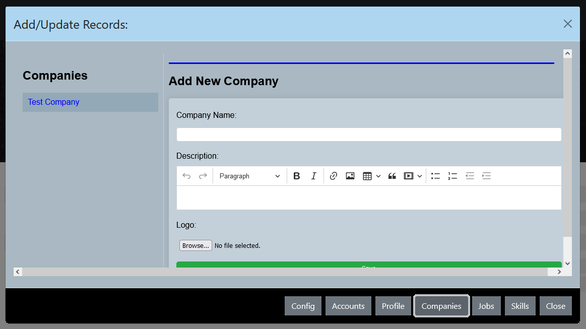
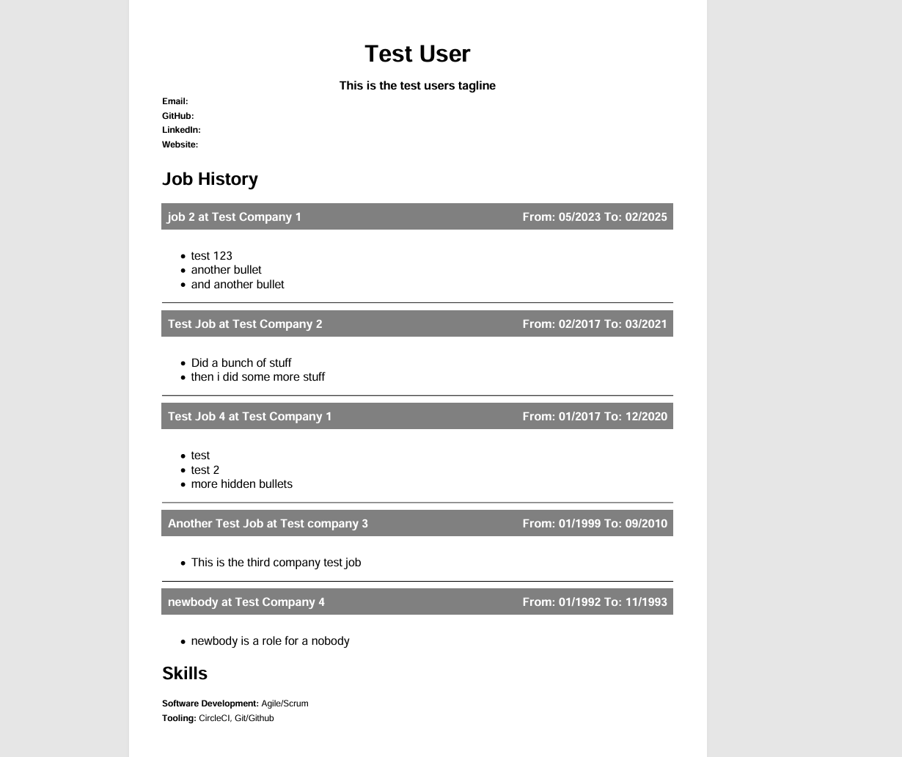

# RESUME BUILDING WEB APPLICATION
A set of PHP scripts that automatically build and present an interactive resume.

# What it does

---

* The entire site is a dynamically loading set of scripts that makes calls to the database to query for information and present it in an interactive website
* The top menu builds your company history from newest to oldest (Left to right) clicking on these menu objects loads your job history in the page below it
* The company specific pages show your job history at that company and are listed by most recent positions first vertically 
* The company logo is displayed to the left of your job history and is a link to a modal that presents the company description information
* The right-aligned login button allows one to login and authenticates with account defined in the user-accounts in the database and creates an authenticated session 
* If the successfully logged in user has an Admin accesslevel, then a new Add/Update button is displayed that allows the user to enter all of their resume details.
* The configured database connection can be managed through the admin portal, using this mechanism one can change the configured database to one that contains different information this might be useful to have multiple variant databases created that tailor the information to a specific industyry or type of role. As an example you can have one database for individual contributor type roles , and one for leadership type roles, or even different industries altogether. 
* Once all all information is entered, you can also generate a PDF Resume based on all the information entered in the various tabs of the admin modal.

---

## Unauthenticated Access


## Job History Page


## Company Info Modal in Job History Page


## Authenticated login with Administrator level credentials


# Admin Modal
The main interface to add all resume details is the Admin modal, which has buttons in the modal footer that allow input for the following:


## Administrator Modal


## Administrator Page (alternate config)
 

### 1. **Config**
**Update database connection details** 
The configuration for connecting to the database can be updated here, including selecting the target database from a drop-down of existing databases, as well as the username and password that connects to the host. The host configuration has been excluded from this configuration screen

## Config tab in Admin Modal
 


### 2. **Accounts** 
**Add/Update Users.** 
This includes User name , Password, and Access Level.

## Accounts tab in Admin Modal


### 3. **Profile**
**Update Profile Information** 
The initial base.php page and the top menu both get information from the profile table in the database. These values can be updated in the admin console modal. 

## Profiles tab in Admin Modal
 

### 4. **Company information** 
**Add/Update companies**. 
This includes the Company name, the Company logo and an html formatted description of the Company itself

## Companies Tab in Admin Modal


### 5. **Job History information** 
**Add/Update jobs.** 
This includes the title of the position they held, the start and end dates, and an html formatted description of the role. 
If they held more than one role, additional entries can be made associated with that same company and the resulting company page would show all roles chronologically from most recent to oldest role 

## Jobs Tab in Admin Modal


### 6. **Skill Categories** 
**Add/Update Categories.** 
This allows grouping of soft and hard skills by category for use on the home page of the generated site 
**Add/Update Skills.** 
This includes indicating the category the skill should be associated with.

## Skills tab in Admin Modal


## Career Statistics in new Admin page 


## PDF Resume in Admin Modal
**Create a PDF resume**
Both FPDF and DOMPDF libraries are present; however, only DOMPDF is available from the admin modal. 
This is because it was easier to retain the HTML formatting of the job description field which looks better than the others.


## Sample PDF Resume output
The generated PDF resume looks similar to the following:




---
## How to use:

- [Installation](#installation)
- [Technologies](#technologies)
- [Dependencies](#dependencies)
- [Team](#team)

---

## Installation
### Clone

- Clone this repository to your local machine using the command below:
```
	$ git clone git@github.com:eldday/webresume.git
```

### Configuration

> For other platform specific information regarding how to configure SSL or Apache with PHP you can try the following resources:

---

* [Debian Apache PHP MariaDB Install](https://www.digitalocean.com/community/tutorials/how-to-install-linux-apache-mariadb-php-lamp-stack-on-debian-10/)

* [Ubuntu LAMP Installation](https://www.digitalocean.com/community/tutorials/how-to-install-lamp-stack-on-ubuntu)

* [Fedora LAMP Installation](https://www.linode.com/docs/guides/how-to-install-lamp-stack-on-fedora-alma-rocky-linux/)

* [CentOS LAMP Installation](https://phoenixnap.com/kb/how-to-install-lamp-stack-on-centos)

---

### Windows Installation
Windows is not fun to get setup and working with apache2, PHP, and MySQL/MariaDB
The first two steps are the most important 

#### Step 1 if you have IIS installed, remove it. 

#### Step 2 Install Chocolatey 
* [Chocolatey](https://docs.chocolatey.org/en-us/)

Then you can use it to install many of the components you will need
from PowerShell prompt as an example:

```
choco install PHP libapache2-mod-php php-mysql

Here is a list of things i was able to quickly install 
- awk 4.2.132
- chocolatey-compatibility.extension 1.0.0
- chocolatey-core.extension 1.4.0
- chocolatey-windowsupdate.extension 1.0.5
- dnscontrol 2.9.0
- git 2.47.1.20250115
- git.install 2.47.1.20250115
- KB2919355 1.0.20160915
- mariadb.install 11.6.2
- mysql 9.2.0
- netstat-agent 3.6.0
- openssh 8.0.0.1
- php 8.4.3
- phpmyadmin 5.1.3
```

#### Debian Linux

> Install PHP, MariaDB, Apache server  (LAMP stack):

```
sudo apt update
sudo apt install apache2
sudo apt install mariadb-server
sudo apt install php libapache2-mod-php php-mysql
sudo nano /etc/apache2/mods-enabled/dir.conf
```
change the following section to show index.php first

```<IfModule mod_dir.c>
    DirectoryIndex index.php index.html index.cgi index.pl index.xhtml index.htm
</IfModule>
```

> Access project root

``` cd /sourcedir  ```

update the utilities/db_connecttion.php script to match your database installation
change the owner and group for the utilities directory, and the images directory
the owner must be set the same as the http server uses (apache2 , nginx, etc...)

```
Replace the empty variables for:

 	Host
	DB Name
	Username
	Password
```

> Seed the database 
The included backup of the database has the following:

* example profile
* example company
* example job
* example categories
* example skills
* Default User accounts {Admin:Password}

...this is enough to show the main menu and allow navigation 
 
``` mysql create database webresume ```

``` mysql -u [user name] -p [targer db name] < webresume.sql ```

> Copy everything in your repo dir to the web server root directory 
``` sudo cp -fr ~/sourcedir /var/www/html/  ```

>Set the appropriate permissions for the utilities and images folders
```
sudo chown -R www-data:www-data /var/www/html/utilities/
sudo chown -R www-data:www-data /var/www/html/images/
```
> Start the Apache2 and MySQL services 

``` 
	sudo service apache2 start
	sudo service mysql start
```
> Verify you can get to the website from your browser using: 

* http(s)://domain name, 
* http(s)://local IP Address 
* http(s)://Localhost

---
## Technologies:
- PHP
- Javascript
- HTML

### Dependencies
* *[PHP](https://www.php.net/downloads.php)*
* *[Apache Server](https://httpd.apache.org/)*
* *[Composer](https://getcomposer.org/)*
* *[DomPDF](https://packagist.org/packages/dompdf/dompdf)*
* *[FPDF](https://packagist.org/packages/setasign/fpdf)*

---
>  Patrick Day  | <a href="https://www.linkedin.com/in/eldday/" target="_blank">**Linkedin**</a> | <a href="https://github.com/eldday" target="_blank">**Github**</a> 

---
